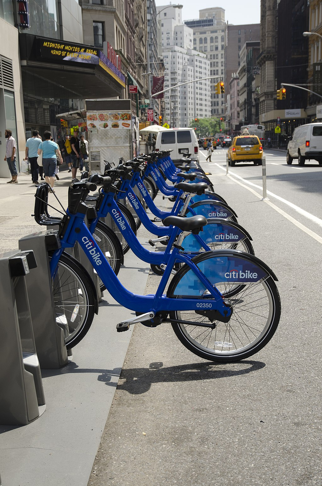
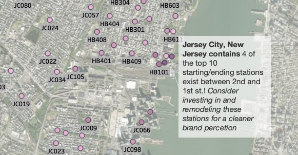
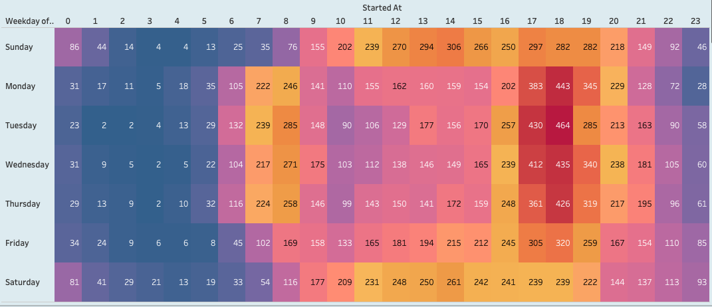
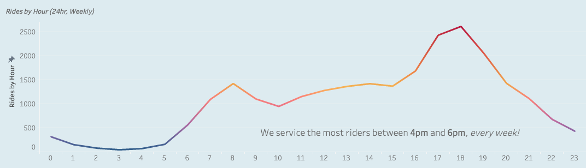
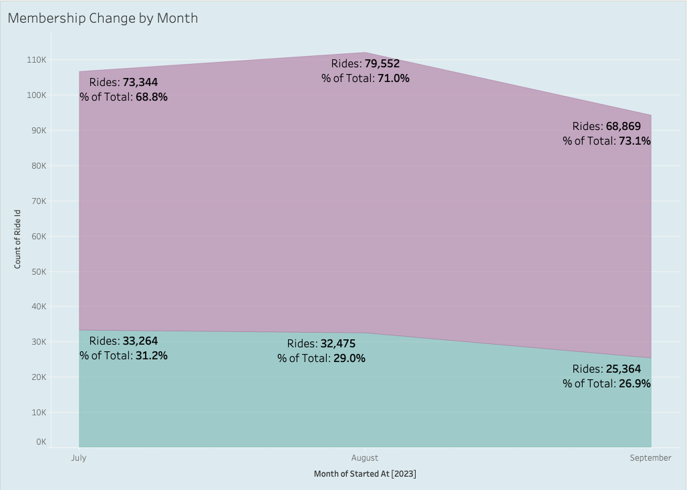
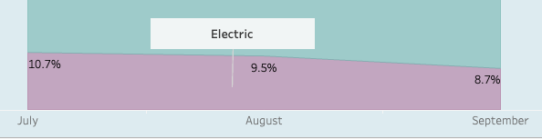
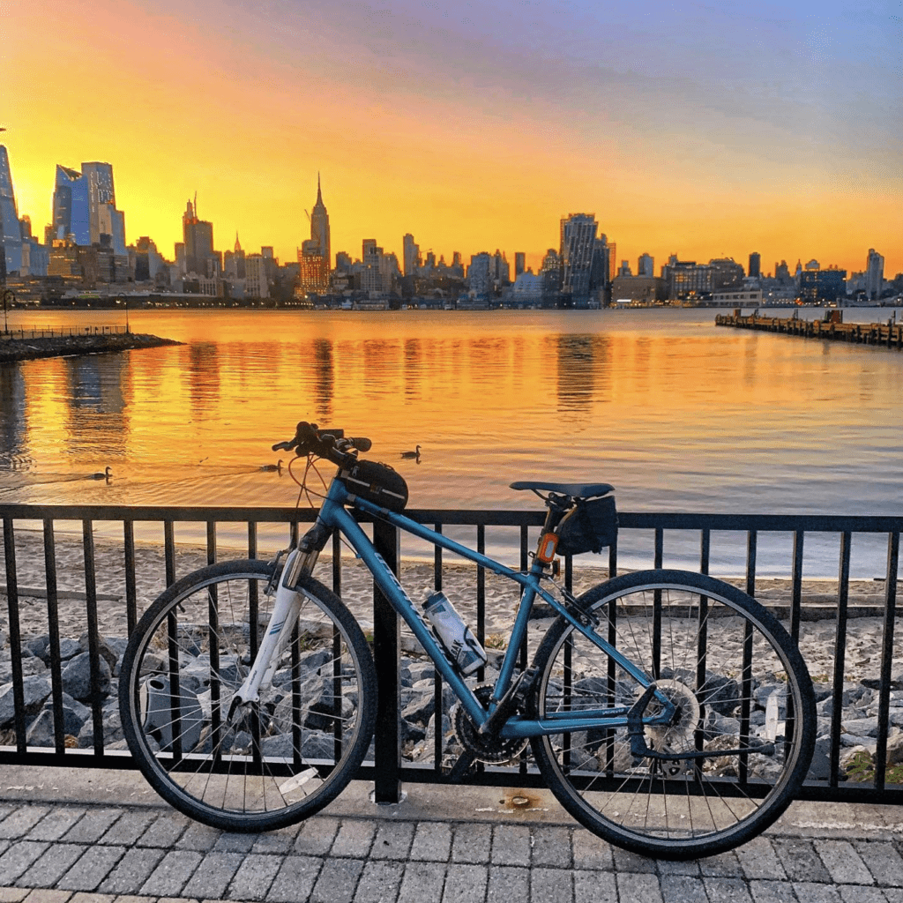

# CitiBike Riders Analysis

The purpose of this analysis is to demonstrate proficiency in Salesforce's Tableau Public by presenting an analysis performed on CitiBike's own [historical records](https://s3.amazonaws.com/tripdata/index.html). The visual analysis and insights of CitiBike rides span the summer months of July-September 2023. {width="50%" height="50%"}

*Note:* 
*This analysis was performed as part of the 2023 UCF Data Analytics and Visualization Bootcamp.*

## Tableau Workbook Access
For the interactive Tableau Story, click [here](https://public.tableau.com/app/profile/nathan.andrew.tompkins/viz/CitiBike2_16981002014400/Story1?publish=yes).
 
For the Tableau .twbx download, click [here](LINK TO WORKBOOK)

## Data Overview
- **Total Number of Rides Recorded:** 312,868
- **Total Number of Bike Stations:** 81
- **Average Length of Each Ride:** 2-3 Minutes 
- **Peak Riding Hours:** 4-6pm
- **Peak Riding Days:** Weekdays, (especially midweek)
- **Rider Categories:** *Member, Non-Member*
- **Most Popular Station:** "JC115", at Christopher Columbus Dr. and Grove St.
- **Most Popular City Area:** Jersey City, New Jersey

## Observations and Recommendations
1. Jersey City 
  1.1 The data reveals that the most popular cluster of stations can be found in Jersey City, New Jersey. This could be because, according to [walkscore.com](https://www.walkscore.com/NJ/Jersey_City) "Jersey City has an average Walk Score of 87 with 247,597 residents." and "has excellent public transportation and is somewhat bikeable.". Over 89,686 (28%) of all rides beginning or ending at these stations. 
  1.2 *Consider investing in increased cleanliness/maintenance for these stations, as well as devloping a marketing stratey to solidify CitiBike as a part of the Jersey City Identity.*  
   

2. Peak Evening Hours  
  2.1 Our riders start and end their rides most frequently between the hours of 4pm and 6pm, peaking on the midweek evenings. This same pattern holds for the hours of 6am to 9am, though to a lesser degree. This may indicate that workers are more likley to walk to their place of work, but ride home after their shift.  
    
    

3. Peak Morning Hours   
  3.1 The data above also indicates that midweek is the height of both evening and **morning** rides. Early morning Commuting increases midweek between 6am and 9am. Could our riders be "treating" themselves by choosing our bikes as a more **premium** transportation option in the middle of the week for both morning and evening commuting? At the start of 'hump-day' or the end of a hard work day? 
  3.2 *Consider developing a "commuter" type rewards system or membership tier, especially for riders who ride every day and develop a "commuter streak".*  

4. Membership Notes 
  4.1 In September, over 73% of all rides were taken by CitiBike members, an increase of 4.5% in July. Jersey City likewise saw member ride growth, percentage of Membership in the Jersey City Area grew from 60% to 67%, indicating a growing userbase. This growth is also reflected in membership rides from July to September. 
  4.2 *Consider increasing membership by offering the above-mentioned reward system or membership option, coupled with value-adding discounts for rides outside of cummuting hours.*  
  4.3 *Consider Adding an "Location" label for each member. "John Doe: Jersey City CitiBike Rider." This may add to the sense of local identity mentioned in the recommendation 1. Observation 1.*  
  4.4    

5. Electric Bike usage decline 
  5.1 While not a stark decline, it is observed that electric bike usage declined by 2% over these months. Do our users want healthier rides (classic bikes), or could this indicate technological issues with our electric option whcih leave our users disatisfied with having a single bike option?
  5.2 *Consider increasing electrical-bike marketingas value to user, cost-benefit for electric/classic bike ratio, and evaluate maintenance logs for most-used bikes*  
  5.3  
   

## Summary
Our Riders find value in our bikes as a commuting tool, particulalry in a very public-transport-accessible and walkable city like Jersey City. Our peak hours are midweek from 6-9am, and in the evening from 6-8pm. Members account for nearly 71% of all rides but value in the product can be increased by targeting our busiest stations for improved maintenance, cultural presense, and more importantly, a more varied nubmer of membership options that encourage daily usage of our bikes.  
   
